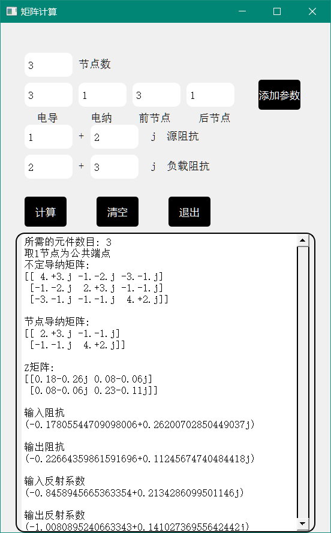

# microwave_fuzhu

## 计算机辅助电磁学结课作业

编程实现对任意多端口微波无源网络的不定导纳矩阵，阻抗参数，导纳矩阵，s参数矩阵求解

使用python numpy库解决

## 解决思路

针对复杂的网络，不能简单的通过算法得到其网络拓扑图结构，所以采用不定导纳矩阵方法，由用户输入节点的数目
假设输入的节点数n为3，假设每个节点间都有一个元件
计算得出节点间的元件数目为Cn2
给定元件的参数表示方法：导纳
用户在命令台输入元件的电导和电纳值
由python的矩阵计算实现计算

## 算法实现

zero()方法	创建一个n*n的全零矩阵
buding()方法	根据不定导纳矩阵的定义，对零矩阵赋值建立单个节点的不定导纳矩阵
sum()方法	对每个元件的不定导纳矩阵求和，得到不定导纳矩阵
result()方法	取公共端点为1节点接地，得到节点的导纳矩阵
Zarray()方法	对导纳矩阵求逆得到Z矩阵
Z()方法	根据级联矩阵电压电流关系，取定j，k节点 求出参数ABCD
Zin,Zout()方法	求电路的输入输出阻抗
Sin,Sout()方法	求电路的输入输出反射系数

## 使用Pyqt进行图形化重构

## 	